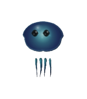
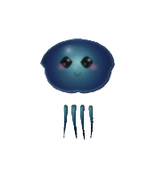
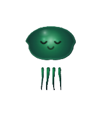
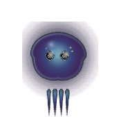
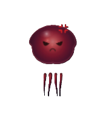

# 🌌 Jelli Companion

<div align="center">
  
  
  <h3>Jelli</h3>
  <p><strong>The Next-Generation Agentic Desktop AI Companion</strong></p>

  <p>
    
    
    
    
  </p>
</div>

---

## 🚀 Overview

**Jelli** merges advanced agentic AI capabilities with a desktop companion interface powered by Tauri v2, React 19, and a secure serverless cloud edge proxy. 

Designed for low latency and high responsiveness, Jelli utilizes the [Dia 2](https://github.com/nari-labs/dia2) speech generation engine sidecar for near-instant speech responses. Clicking the floating desktop widget opens a glassmorphic chat interface, streams the LLM response character-by-character, and progressively synthesizes voice output.

Upstream inference is managed by a secure, zero-config Cloudflare Worker proxy that isolates developer API credentials from client binary decompilation threats or network packet analysis.

---

## ✨ Key Features

* 🪼 **Luminous Vector Blob:** Dynamic, 60fps plasma energy blob featuring rotating inner filaments, particle orbits, electric dome outlines, and fluid physics-simulated swimming tentacles.
* 🪟 **Two-Window Architecture:** Frameless, transparent windows that move in lockstep without blocking click-through areas of the screen or capturing mouse clicks over normal Windows desktop items.
* 💬 **iMessage-Style UI:** Sleek, glassmorphic floating chat bubble with smooth spring animations, responsive dynamic height scaling, and autocomplete slash command navigability.
* 🔒 **Secure Cloud Gateway Proxy:** Centralized edge middleware (`jelli-gateway`) that abstracts developer API keys (`GROQ_API_KEY`, `MISTRAL_API_KEY`, `OPENROUTER_API_KEY`) and prevents network sniffing.
* ⚡ **3-Tier Cascading Failover:** Automatic sequential fallback loops executing in the cloud (Groq `llama-3.1-8b-instant` ➔ Mistral Small ➔ OpenRouter Free).
* 🛡️ **Abuse & Injection Guardrails:** Enforces IP-based rate limiting (max 10 requests per minute) and sanitizes incoming payloads to discard prompt injection or system persona overrides.
* 🔄 **Mid-Stream Clear Events:** Worker emits `data: [CLEAR]` events on mid-stream fallback handovers, signaling the client to reset its bubble text before the next tier resumes.
* 🎙️ **Low-Latency Voice:** Real-time voice generation using **Dia 2** with gapless streaming PCM chunk audio over Tauri IPC.

---

## 🔮 Blob States & Expressions

Experience a dynamic desktop companion that morphs organically based on your interactions:

| **Idle (Normal)** | **Shy (Cursor Hover)** | **Happy (Petting)** |
| :---: | :---: | :---: |
|  |  |  |
| Baseline calm state with gentle breathing and cycling gradients | Blushes and tracks the mouse cursor system-wide | Warm green/yellow glow with cute crescent-smile eyes |

| **Sleep** | **Dizzy (Dragging)** | **Rage (Angry)** |
| :---: | :---: | :---: |
|  |  |  |
| Deep purple body with peaceful sleeping eyelids and floating "zZz" particles | Erratic physics and spinning stars orbit the blob post-drag | Intense crimson-red body with an animated anger vein 💢 |

---

## 🏗️ Architecture & Data Flow

The following diagram illustrates how the Two-Window desktop app coordinates with the local speech engine and the secure Cloud Worker gateway:

```mermaid
graph TD
    User([User Click]) -->|Triggers| MainWin[Main Blob Window 140x160]
    MainWin -->|Position Sync| ChatWin[Chat Textbox Window]
    ChatWin -->|Input Sent| Rust[Rust Tauri Core]
    Rust -->|Secure POST Request| Proxy[Cloudflare Worker Gateway Proxy]
    
    subgraph Cloud Gateway (Cascade Routing)
        Proxy -->|1. Try Groq| Groq[Groq API]
        Proxy -->|2. Fallback| Mistral[Mistral AI API]
        Proxy -->|3. Fallback| OpenRouter[OpenRouter Free API]
        Groq & Mistral & OpenRouter -->|SSE Stream| Proxy
    end
    
    Proxy -->|Relayed SSE + [CLEAR]| Rust
    Rust -->|Token Events| ChatWin
    Rust -->|Generate Speech| Dia2[Dia 2 TTS Engine]
    Dia2 -->|PCM Audio Chunks| Rust
    Rust -->|IPC Base64 Audio| ChatWin
    ChatWin -->|Web Audio Playback| Speaker([Audio Output])
```

---

## 🛠️ Repository Structure

Here is a quick look at the main modules of the **Jelli** ecosystem:

| Module | Purpose | Tech Stack |
| :--- | :--- | :--- |
| **[`/jelli-companion`](./jelli-companion)** | Desktop Client App | React 19, TypeScript, Vite, Tauri v2, CSS Glassmorphism |
| **[`/jelli-gateway`](./jelli-gateway)** | Secure Inference Gateway | Cloudflare Workers, TypeScript, Wrangler, Miniflare |
| **[`/progress`](./progress)** | Roadmap & Consolidated Progress Logs | Markdown progress log archive |

---

## ⚙️ Development Setup

### Prerequisite Checklist
- [Rust & Cargo](https://www.rust-lang.org/tools/install) (latest stable toolchain)
- [Node.js](https://nodejs.org/) (v18 or higher)
- [Wrangler CLI](https://developers.cloudflare.com/workers/wrangler/install-and-update/) (for gateway worker development)

### 1. Launch Cloud Gateway Locally
To run the serverless edge proxy gateway locally for testing:
```bash
cd jelli-gateway
npm install
# Run Wrangler dev server on local port 8787
npm run dev
```
Configure your secrets (`GROQ_API_KEY`, `MISTRAL_API_KEY`, `OPENROUTER_API_KEY`) inside a local `jelli-gateway/.dev.vars` file.

### 2. Launch Jelli Desktop App
To run the Tauri companion application in development mode:
```bash
cd jelli-companion
npm install

# (Optional) Point client to your local worker server for development
# $env:JELLI_GATEWAY_URL="http://127.0.0.1:8787/v1/chat"

npm run tauri dev
```

---

## 📅 Roadmap & Progress

Check out the [`progress/`](./progress) folder for detailed milestone phases and changelogs.

- [x] **Phase 1**: Foundation & Window Setup
- [x] **Phase 2**: iMessage-Style Chat UI & Settings
- [x] **Phase 4**: LLM Proxy & TTS Pipeline (Transitioned to Dia 2)
- [x] **Phase 6**: Luminous Blob Visual Design & Two-Window Sync
- [x] **Phase 7**: Secure Cloud Gateway Proxy & Client Key Abstraction (CF Workers)
- [ ] **Phase 5**: Particles Swarm & Installer Compilation

---

<div align="center">
  <sub>Built with ❤️ by the Jelli Development Team</sub>
</div>
