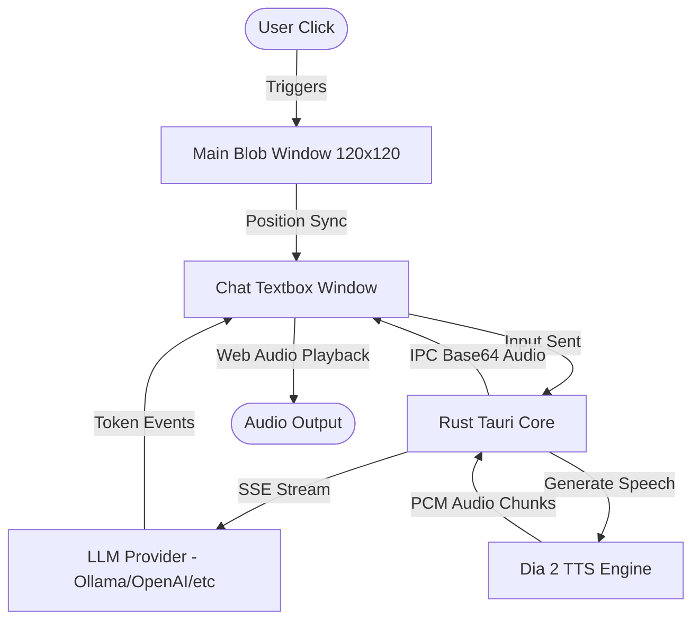

# 🌌 Jelli

  
  
  <h3>Jelli</h3>
  
<strong>The Next-Generation Agentic Desktop Experience</strong>

  

    
    
    
  

---

## 🚀 Overview

**Jelli** merges advanced agentic AI capabilities with a desktop companion interface powered by Tauri v2, React 19, and local/remote LLM orchestration. 

Built for speed and responsiveness, Jelli utilizes the [Dia 2](https://github.com/nari-labs/dia2) speech generation engine for near-instant speech responses. Clicking the floating desktop widget opens a glassmorphic chat interface, streams the LLM response character-by-character, and progressively synthesizes voice output.

---

## ✨ Key Features

- 🔮 **Luminous Vector Blob**: Dynamic, 60fps plasma energy blob with lightning arcs, orbiting particles, and rotating filaments.
- 🪟 **Two-Window Architecture**: Frameless, transparent windows that move in lockstep without blocking click-through areas of the screen.
- 💬 **iMessage-Style UI**: Sleek, glassmorphic floating chat bubble with smooth spring animations and responsive text expansion.
- 🎙️ **Low-Latency Voice**: Real-time voice generation using **Dia 2** with streaming PCM chunk audio over Tauri IPC.
- 🧠 **Multi-Provider LLM Proxy**: Deep integration with Ollama, OpenAI, Anthropic, Gemini, and DeepSeek, including instant cancellation.

---

## 🔮 Blob States & Expressions

Experience a dynamic desktop companion that morphs organically based on your interactions:

| **Idle (Normal)** | **Shy (Cursor Hover)** | **Happy (Petting)** |
| :---: | :---: | :---: |
|  |  |  |
| Baseline calm state with gentle breathing and cycling gradients | Blushes and tracks the mouse cursor system-wide | Warm green/yellow glow with cute crescent-smile eyes |

| **Sleep** | **Dizzy (Dragging)** | **Rage (Angry)** |
| :---: | :---: | :---: |
|  |  |  |
| Deep purple body with peaceful sleeping eyelids and floating "zZz" particles | Erratic physics and spinning stars orbit the blob post-drag | Intense crimson-red body with an animated anger vein 💢 |

---

## 🏗️ Architecture

---

## 🛠️ Repository Structure

Here is a quick look at the main modules of the **Jelli** ecosystem:

| Module | Purpose | Tech Stack |
| :--- | :--- | :--- |
| [`/jelli-companion`](./jelli-companion) | Main Desktop App Shell | React 19, TypeScript, Vite, Tauri v2, Dia 2 Sidecar |
| [`/progress`](./progress) | Development Roadmaps & Phases | Consolidated Markdown logs |
| [`.claude`](./.claude) | Workspace and Agent Settings | Local permissions & JSON Config |

---

## 📅 Roadmap & Progress

Check out the [`progress/`](./progress) folder for details on our active milestones.

* [x] **Phase 1**: Foundation & Window Setup
* [x] **Phase 2**: iMessage-Style Chat UI & Settings
* [ ] **Phase 3**: Desktop Awareness (Deferred)
* [x] **Phase 4**: LLM Proxy & TTS Pipeline (Transitioned to Dia 2)
* [ ] **Phase 5**: Particles Swarm & Installer Compilation
* [x] **Phase 6**: Luminous Blob Visual Design & Two-Window Sync

---

  Built with ❤️ by the Jelli Development Team

